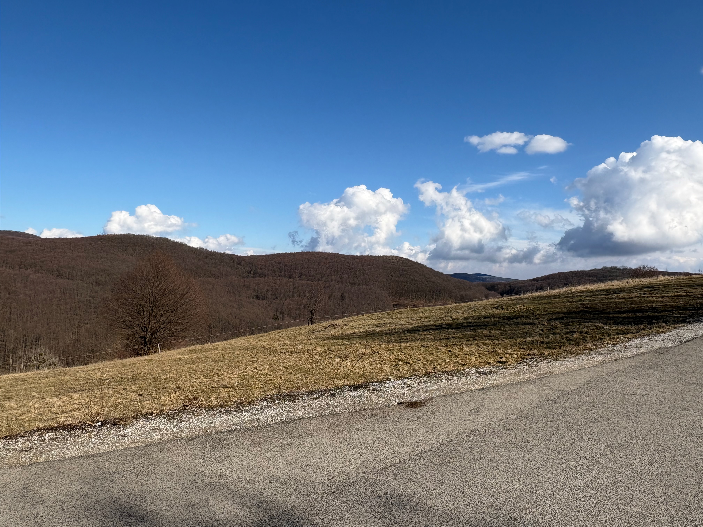

# In Defense of Common Sense

{width=100% fig-align="left"}

With this one I will do something different.  
This will be a reasoning without data.
However I expect that this will strengthen this reasoning, not weaken it, and in fact that is going to be the point itself.
I will talk about common sense.  

Which is innately human.  
Which we all have.  
Which we all need.  

Although in our current age of quantity, I fear this is under attack.

And all the data in the world won't help if we lose common sense.
In fact the data will be no signal, but noise, and the abyss we stare at.

But what if we do not look up to the sky.
We just get the data. 
The color of the sky is RGB 0,0,255.
Sounds right.
Very scientific.
Very specific.
Very convincing.  

# Here We Go

{width=100% fig-align="left"}

Everybody knows what this is.  
Many people can imagine a weight around 50kg. Nobody can imagine 6 million tons.
Some of us managed projects. None of use without modern communication tools.
Some of constructed simple things with modern tools.
We have some sense of time.
All of have very good sense of human limitations.
Including costs, rewards, motivations.
All of us understands the Sun.
Most of use can imagine really hot conditions.
Some of us can imagine 140 meters height.
Some of use have moved furniture, which we considered heavy.
None of us can imagine the number 2,3 million.
All of us know what stones are. A few of us understand the differences in hardness.
Few of us understand that some things like friction does not scale linearly.
Most of us know what linear is.
A few of us understand what is geometrical. 

This is all common sense and experienced reality.
The problem is, that we humans are excellent at knowing something, and not applying that in a different domain.
We are the masters of thinking simultan contradictions.

# As Below, So Above

I could have made the same arguement using numbers, equations and good estimations.
However I would have lost the game.
Because I cannot surrender to the quantity game.
Because common sense is paramount.

I do not know who built that and how.  
But I have common sense. And it says that this is not from the bronze age.

